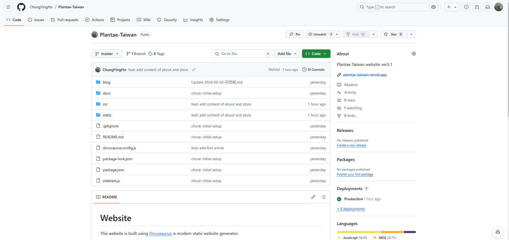
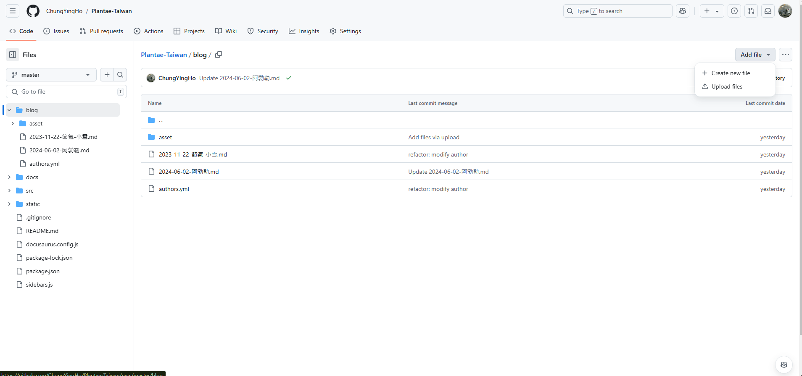
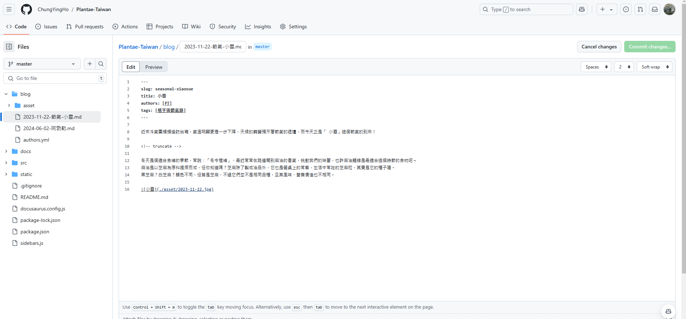
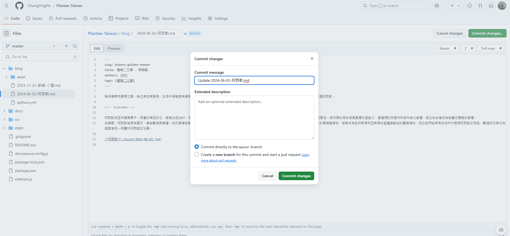
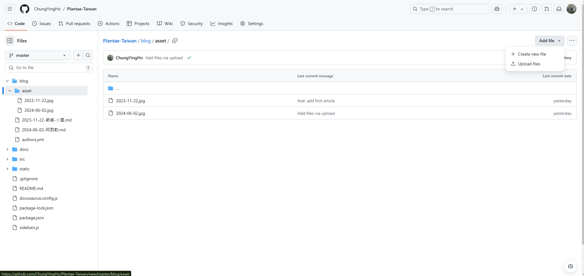
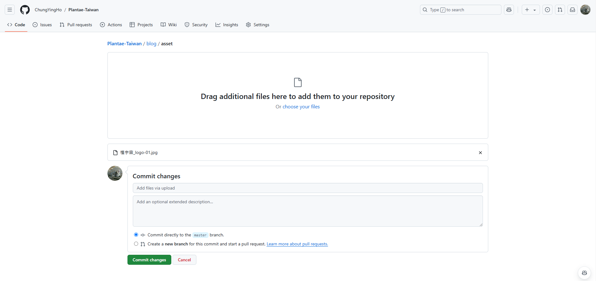

## 貼文撰寫
1. 找到 **blog** 資料夾



2. 點進去後，右上角有個 **Add fil**，點下去後選擇 **Create new file**



3. **Name your file...** 輸入檔案名稱，檔案名稱請以 **年-月-日-標題.md** 的方式命名，例如：**2021-01-01-Hello-World.md**。
內文請參考以下範例，注意前面一定要有 **---**，這是標頭的開始，後面也要有 **---**，這是標頭的結束。

```markdown
---
slug: seasonal-xiaoxue
title: 小雪
authors: [PT]
tags: [植宇宙節氣錄]
---

近來冷氣團頻頻造訪台灣，氣溫明顯更進一步下降，天候的轉變預示著節氣的遞嬗，而今天正是「 小雪」這個節氣的到來！

<!-- truncate -->

冬天是個適合食補的季節，常說：「冬令進補」，最近常常在路邊聞到麻油的香氣，挑動我們的味蕾，也許麻油麵線是最適合這個時節的食物吧～
麻油是以芝麻為原料提煉而成，但你知道嗎？芝麻除了製成油品外，它也是餐桌上的常客，生活中常吃的芝麻粒，其實是它的種子喔。
黑芝麻？白芝麻？顏色不同，但皆是芝麻，不過它們並不是相同品種，且其風味、營養價值也不相同。


```

- **slug**：網址的網址，請以英文命名，並以 **-** 連接，例如：**seasonal-xiaoxue**
  - 植物二三事請命名為 **plant-xxx**
  - 植宇宙節氣錄請命名為 **seasonal-xxx**
  - 產品介紹請命名為 **product-xxx**
- **title**：文章標題，請以中文命名，例如：**小雪**
- **authors**：作者，請輸入 **[PT]**
- **tags**：標籤，例如：**[植宇宙節氣錄]**
- `<!-- truncate -->`：這是摘要的分隔線，這之後的內容會被截斷。前面的內容會顯示在首頁的文章列表中，點進去文章才會看到後續全部內容。



4. 撰寫完內文後，點選 **Commit new file** 進行儲存 (如果是編輯文章，就是 **Commit changes**)。
  - 請不要修改 **commit message** 跟 **Extended description**，下面選項也確保選擇 **Commit directly to the master branch**，然後點選 **Commit new file** (或 **Commit changes**)。



## 照片上傳
1. 跟文章同一層有個 **asset** 資料夾，點進去後，右上角有個 **Add fil**，點下去後選擇 **Upload files**



2. 選擇要上傳的檔案，並點選 **Commit changes**
  - 不要動其它設定，並且確認選項在 **Commit directly to the master branch**，然後點選 **Commit changes**。
  - 照片名稱請已發文日期命名，例如：**2023-11-22.jpg**



3. 在文章中引用照片時，請使用相對路徑，例如：``

## 其它網站架構
1. src/pages/about.mdx：關於我們頁面，可以自行編輯文字內容
  - 照片放在 **static/img** 資料夾，引用時請使用相對路徑，例如：``，注意引用時不用帶 **static**。
2. src/pages/store.msx：產品介紹頁面，可以自行編輯文字內容
  - 照片放在 **static/img/product** 資料夾，引用時請使用相對路徑，例如：`<img src="/img/product/pomelo-10.jpg"`，注意引用時不用帶 **static**。