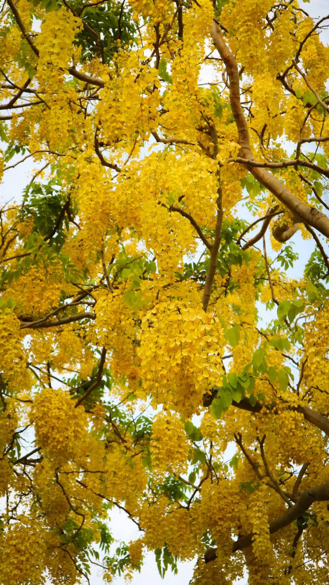

每年春季和夏季之間，各位有沒有發現，生活中有幾處角落種植著盛開金黃色花朵的樹木，它的花串垂掛，花期長達數週，樹冠如同披上金色外衣，這便是阿勃勒。

<!-- truncate -->

阿勃勒為豆科落葉喬木。原產於南亞的它，樹高10至20米，喜愛溫暖、陽光充足的環境，耐旱力強，對土壤要求不高，但在排水良好、肥沃的土壤中生長更佳。其深厚的根系使其具備抗風能力，是理想的防風林和城市綠化樹種，因此在台灣成為被廣泛種植的樹種。
在泰國，阿勃勒被視為國花，象徵繁榮與幸運。在印度傳統醫學中，阿勃勒的花、果、葉具有藥用價值，可緩解便秘、抗炎和抗菌。其美麗的花朵和強大的環境適應性，使其成為全球熱帶和亞熱帶地區廣受歡迎的觀賞植物，因此我們能常常在城市中發現阿勃勒的芳蹤，繁複的花串也為盛夏增添一抹屬於阿勃勒的淡黃。

