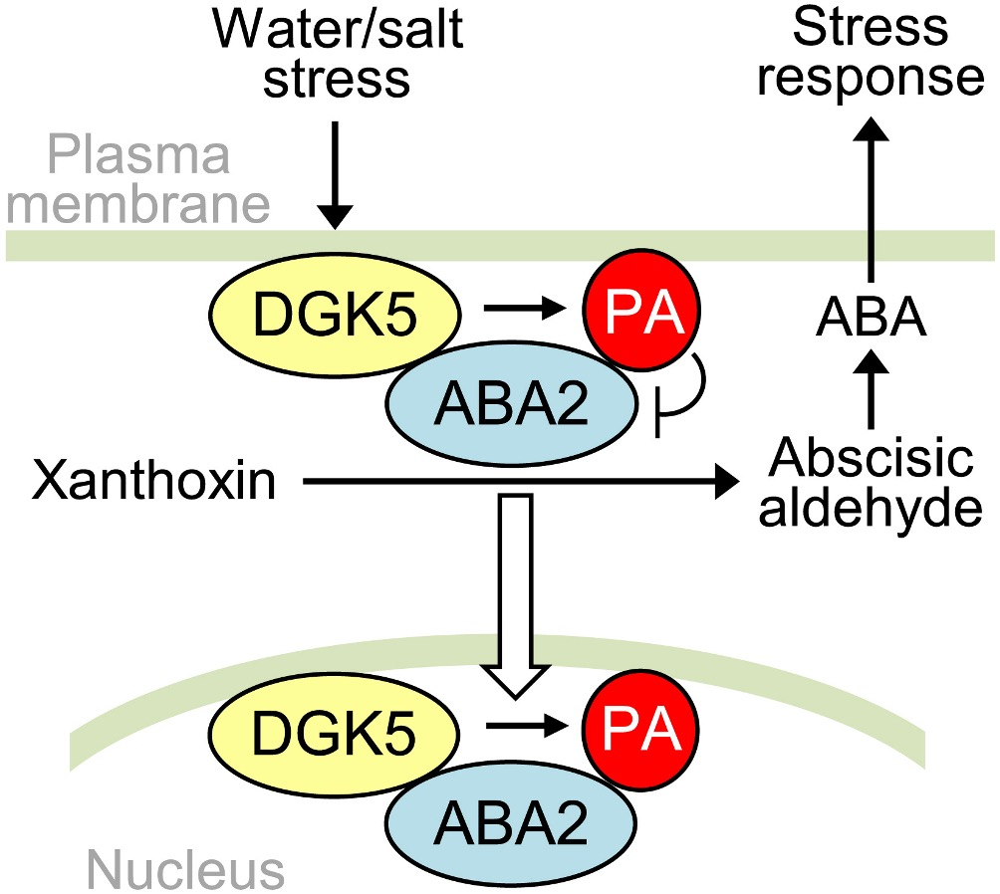

Abscisic acid (ABA) is a crusical plants hormones, ABA helps plant to survival in stresses. However, the regulation of ABA biosynthesis is still unknown.

<!-- truncate -->

ABA is made from Zeaxanthin and violaxanthin, however the negative regulation of ABA biosynthesis is still unknown. now we found that strigolactones and Phosphatidic acid (PA) can regulation negatively regulate ABA biosynthesis.

